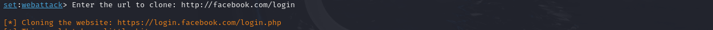

- 1 - Acessar o usuário root -> ```sudo su```


- 2 - Acessar o SEToolKit -> ```setoolkit```


- 3 - Escolher a opção ```Social-Engineering Attacks```

- 4 - Escolher a opção ```Website Attack Vectors```

- 5 - Escolher a opção ```Credential Harvester Attack Method```

- 6 - Escolher a opção ```Site Cloner```

- 7 - Colocar o IP da máquina -> Obtido pelo comando ```ifconfig```

- 8 - Colocar o URL do site a ser clonado -> URL utilizado: http://www.facebook.com



- 9 - Acessar o site pelo IP da máquina


- Os valores inseridos nos campos de email e senha aparecerão na linha de comando
